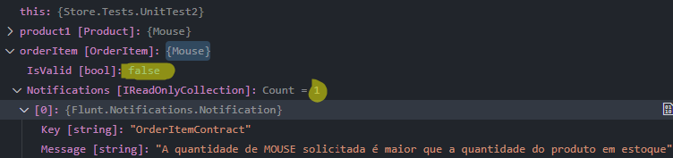
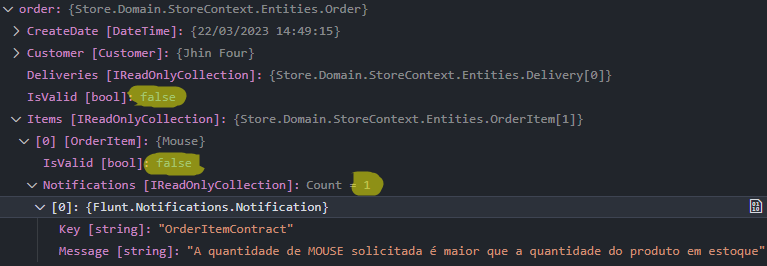
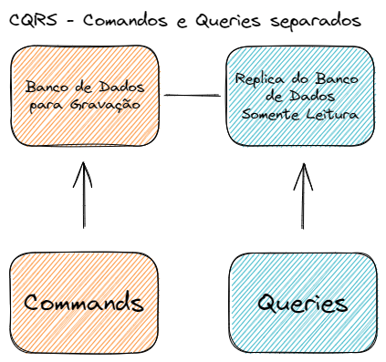
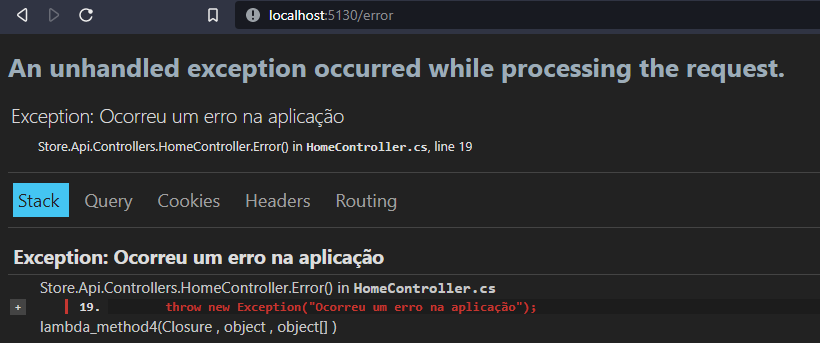
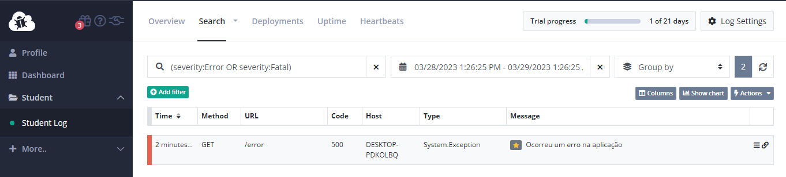

# APIs com ASP.NET e Dapper

Projeto Web para estudos e revisão de conceitos seguindo o curso [balta.io](https://github.com/balta-io/1974)

## Organizando a solução com projetos

Estrutura inicial:

- **Store.Domain** | Domínio com todas as regras de negócios da aplicação, com o processamento das informações. Será um projeto do tipo Class Library, apenas uma DLL.
- **Store.Shared** | Responsável pelas informações compartilhadas no projeto. Class Library.
- **Store.Infra** | Responsável pelo acesso a dados. Será um Class Library, apenas uma DLL.
- **Store.Tests** | Mocks e testes da aplicação.
- **Store.Api** | Disponibiliza as informações em JSON para consumo. Será um projeto Web.

## Criando os projetos

Todos os comandos para criação de projetos via CLI podem ser consultados [aqui](https://learn.microsoft.com/pt-br/dotnet/core/tools/dotnet-new).

```csharp
// Cria o projeto do tipo Web dentro do Store.Api
dotnet new web

// Cria o projeto do tipo Class Library dentro das pastas dos outros projetos
dotnet new classlib

// Cria o projeto de testes
dotnet new mstest
```

## Criando a Solution

Após criar a estrutura de pastas e definir cada tipo de projeto, vamos criar uma solution. A solution ou solução é a forma de referenciar os projetos entre si no .NET. Utilize o comando no diretório raiz do projeto:

```csharp
dotnet new sln
```

Agora vamos configurar quais projetos fazem parte da solution:

```csharp
dotnet sln add .\Store.Domain\
dotnet sln add .\Store.Shared\
dotnet sln add .\Store.Infra\
dotnet sln add .\Store.Tests\
dotnet sln add .\Store.Api\
```

Depois da configuração, é possível fazer debug da aplicação.

## Modelando o domínio

A parte mais importante é a modelagem. Na modelagem, organizamos todo o fluxo da aplicação em componentes.
Esses componentes devem trabalhar em conjunto para deixar a aplicação flexível e performática.

A modelagem deve resolver os problemas e não criar outros. O verdadeiro desenvolvedor resolve problemas e cria soluções. 👍

O domínio rico resolve os problemas Core. Com essa abordagem, criamos propriedades de tipos complexos, possibilitando validações nas regras de negócio, sem ficar repetindo as mesmas condicionais em diversos pontos da aplicação.

## Sub domínios

A intenção é quebrar sistemas grandes e complexos em módulos menores. Pensando em um ERP, temos os módulos Manutenção, Financeiro, Comercial, Compras, Vendas. Cada módulo é um sub domínio.

Assim, cada time pode trabalhar em um sub domínio. Cada sub domínio será um novo projeto.

As APIs promovem a comunicação entre os sub domínios. Os sistemas distribuídos podem ser a solução para lidar com sistemas muito grandes.

Trabalhando com metodologias ágeis, temos as entregas parciais. Essas entregas parciais com sistemas modulares podem ser atendidas, dando visibilidade ao cliente do progresso da aplicação.

## Contextos Delimitados

Após a segmentação, temos que limitar o escopo. Qual o problema que a aplicação desenvolvida irá resolver? Essa deve ser a definição. Os Bounded Contexts são um conjunto de funcionalidades para atender o sistema de forma mais simples. Crie pastas para organizar os contextos dentro do domínio.

## Revisando conceitos de POO

Vamos iniciar com uma classe de Cliente anêmica, com propriedades primitivas do Csharp.

```csharp
namespace Store.Domain.StoreContext;
public class Customer
{
    // Propriedades
    public string Name { get; set; }
    public DateTime BirthDate { get; set; }
    public decimal Salary { get; set; }

    // Métodos
    public void Register() { }

    // Eventos
    public void OnRegister() { }
}
```

Essa é a representação de uma classe bem simples, com todo o acesso público.
Se for criada uma instancia dessa classe (Ex: **var customer = new Customer()**), temos acesso direto a ler e alterar as propriedades, bem como usar seus métodos e eventos.

Mais um exemplo rápido com selamento e herança.

```csharp
namespace Store.Domain.StoreContext;

// A palavra reservada abstract bloqueia instancia direta da classe. Já sealed bloqueia qualquer herança.
public abstract class Person
{
    public string Name { get; set; }
    public DateTime BirthDate { get; set; }
    public decimal Salary { get; set; }
}

public class Customer : Person
{
    // Propriedades recebidas via herança
    // Métodos
    public void Register() { }
    // Eventos
    public void OnRegister() { }
}

public class SalesMan : Person
{
    //Propriedades, Métodos e Eventos herdados de Person
}

public class Test
{
    public Test()
    {
        var customer = new Customer();
        customer.Name = "Tom";
        var salesMan = new SalesMan();
        salesMan.Salary = 1299M;
    }
}
```

Exemplo com interfaces. A interface é como um contrato de utilização, que contém apenas as definições obrigatórias à serem implementadas.

Para que uma classe possa usar uma ou várias interfaces, ela é obrigada a implementar todas as propriedades e métodos definidos.

```csharp
namespace Store.Domain.StoreContext;

public interface IPerson
{
    // Definição das propriedades
    string Name { get; set; }
    DateTime BirthDate { get; set; }

    // Definição dos métodos
    void Register();

}

public interface IEmployee
{
    public decimal Salary { get; set; }
}

// Implementação de múltiplas interfaces: IPessoa e IEmpregado.
public class Customer : IPerson, IEmployee
{
    // As propriedades e métodos são importadas pela IDE.
    public string Name { get; set; }
    public DateTime BirthDate { get; set; }
    public decimal Salary { get; set; }

    public void Register()
    {
        // Implementar
    }

    // Podemos sobrescrever o método ToString em qualquer classe.
    // Todos os objetos do .NET herdam da classe raiz System.Object
    public override string ToString()
    {
        return Name;
    }
}

public class Test
{
    public Test()
    {
        var customer = new Customer();
        customer.Name = "John";

        // Retorna o nome do cliente por conta da sobrescrita.
        customer.ToString();
    }
}
```

## Definindo Entidades

Continuando com os conceitos de modelagem, é necessário dominar as regras de negócio para um bom desenvolvimento de software. E o que são essas benditas regras? 🤔

As regras são o fluxo de processo, por exemplo uma compra online simplificado:

- O cliente acessa o site da loja.
- Visualiza o catálogo de produtos.
- Adiciona os produtos ao carrinho.
- Fecha o pedido.
- Faz o pagamento.
- É gerada a Nota Fiscal.
- É separado o pedido para entrega.
- O pedido é enviado ao cliente.

Extraímos os responsáveis pela execução de cada ação do fluxo. Com essa definição, organizamos e identificamos os detalhes para tornar o processo viável em uma aplicação. Por último, armazenamos essas informações organizadas nas **Entidades**, que são separadas por responsabilidades.

Então teríamos as entidades:

- Cliente
- Produto
- Pedido
- Pagamento
- Nota Fiscal
- Entrega

Normalmente a maior parte das entidades são aquelas que serão salvas no banco de dados. Nesse exemplo, o carrinho não precisa ser representado, podemos tratar apenas como a lista de produtos quando o pedido é fechado.

Baseie o desenvolvimento seguindo a ordem do fluxo da aplicação. Comece com o que é necessário para iniciar o processo para poder chegar até o final. Raciocínio:

- Posso fazer a entrega sem uma nota fiscal? Não, então tenho que desenvolver a NF antes.
- Posso ter a NF gerada sem pagamento? Não, então tenho que desenvolver o pagamento.
- Posso ter um pagamento sem pedido? Não, então tenho que desenvolver o pedido.
- Posso ter um pedido sem produto? Não, então tenho que desenvolver o produto.
- Posso ter um produto sem cliente? Não, então tenho que iniciar pelo cliente.

Vá segmentando as entidades, como no caso de pedido, teremos itens no pedido baseados no catalogo de produtos, podendo ser representado por uma entidade **OrderItem**.

Uma entidade básica de cliente poderia ser definida assim:

```csharp
namespace Store.Domain.StoreContext;
public class Customer
{
    public string FirstName { get; set; }
    public string LastName { get; set; }
    public string Document { get; set; }
    public string Email { get; set; }
    public string Phone { get; set; }
    public string Address { get; set; }
}
```

Está tudo como **string**💩. Isso será melhorado conforme aprimoramos a modelagem para termos um domínio rico.

## Corrupção no código

Como todas as propriedades são do tipo público e possuem os métodos de acesso get e set, ao criar um objeto em qualquer lugar da aplicação será possível alterar esses valores. Esse comportamento deve ser limitado.

```csharp
var customer = new Customer(
    "Jhin",
    "Four",
    "4444",
    "jhin@four.4",
    "4444-4444",
    "Rua 4"
);

// Estou criando corrupção no código, alterando uma propriedade do objeto diretamente.
customer.FirstName = "";
```

Uma primeira medida é criar um construtor padrão para passar os valores das propriedades.

```csharp
public Customer(
    string firstName,
    string lastName,
    string document,
    string email,
    string phone,
    string address)
{
    FirstName = firstName;
    LastName = lastName;
    Document = document;
    Email = email;
    Phone = phone;
    Address = address;
}
```

Outra medida de proteção é limitar o escopo do set como **private**.

```csharp
public string FirstName { get; private set; }
public string LastName { get; private set; }
public string Document { get; private set; }
```

Assim estamos **blindando** o código. Essa abordagem faz parte do conjunto de princípios de design chamado **SOLID**:

`S` -> Single Responsibility Principle (Princípio da Responsabilidade Única), que defende que uma classe deve ter apenas uma responsabilidade. As regras de negocio como alterações de comportamento devem estar contidas na classe e não podem ser alteradas de fora. Ex: O método para gerar um Pedido deve estar na entidade Pedido.

`O` -> Open/Closed Principle (Princípio Aberto/Fechado), que estabelece que uma entidade de software deve estar aberta para extensão, mas fechada para modificação. Em outras palavras, as mudanças devem ser feitas através de adições de novas funcionalidades, sem alterar o código existente. Ex: a classe Pessoa pode ser herdada por Vendedor, mas não pode ser alterada.

`L` -> Liskov Substitution Principle (Princípio da Substituição de Liskov), que diz que as subclasses devem ser substituíveis por suas classes base sem afetar a integridade do sistema. Ex: Não posso criar uma classe Retângulo e criar uma classe que faz herança dela chamada Quadrado.

As propriedades seriam diferentes. Se você tentar alterar o valor da altura ou largura de um objeto Quadrado, isso afetará o valor do outro atributo. Por exemplo, se você alterar o valor da altura de um quadrado, o valor da largura também será alterado, pois ambos são iguais.

Isso viola o princípio da substituição de Liskov, pois não é possível substituir um objeto Retângulo por um objeto Quadrado, já que o comportamento esperado não será o mesmo. Portanto, essa implementação não é correta e precisa ser ajustada. Seria mais apropriado criar uma classe base Forma, e as classes filhas como Retângulo e Quadrado herdariam dela.

`I` -> Interface Segregation Principle (Princípio da Segregação de Interfaces), que prega que uma classe não deve ser forçada a implementar interfaces que não utiliza. Em vez disso, é melhor dividir a classe em interfaces menores e mais específicas. Isso evita a poluição da interface com métodos desnecessários e torna o código mais claro e fácil de entender. Ex: Uma classe chamada Impressora. Essa classe tem dois métodos: imprimir() e digitalizar().

Agora imagine que você tem outra classe chamada Scanner, que tem apenas um método: digitalizar(). De acordo com o princípio da segregação de interfaces, seria mais apropriado dividir a classe Impressora em duas interfaces separadas: uma interface Impressora com o método imprimir(), e outra interface Scanner com o método digitalizar().

Dessa forma, a classe Impressora poderia implementar apenas a interface Impressora, enquanto a classe Scanner poderia implementar apenas a interface Scanner. E se houvesse outra classe que precisasse tanto imprimir quanto digitalizar, ela poderia implementar ambas as interfaces.

`D` -> Dependency Inversion Principle (Princípio da Inversão de Dependência), que sugere que as dependências devem ser invertidas, de forma que os módulos de alto nível não dependam de módulos de baixo nível, mas ambos dependam de abstrações. A intenção aqui é criar componentes na aplicação, evitando o acoplamento e dependência.

## Ajustando as Entidades

A ordem das declarações na Entidade de cima para baixo são:

1. Constantes e Variáveis privadas.
2. Construtores
3. Propriedades
4. Métodos

Aplicando os ajustes simples:

- Crie um construtor padrão com as propriedades.
- Marque os métodos set como private, permitindo a escrita somente no construtor ou em um novo método específico.
- Faça a sobrescrita do ToString(), sempre retornando o que for mais conveniente no contexto da classe. Ex: NomeCompleto, TituloEResumo, RuaNumeroBairroCidadeEstadoPais, etc.

  ```csharp
  public override string ToString()
  {
      return $"{FirstName} {LastName}";
  }
  ```

- Verifique a possibilidade de criar Enumeradores.
  Os Enums limitam a quantidade de opções que podem ser selecionadas.

  ```csharp
  namespace Store.Domain.StoreContext.Enums;
  public enum EOrderStatus
  {
    Create = 1,
    Paid = 2,
    Shipped = 3,
    Canceled = 4
  }
  ```

- Ao trabalhar com listas, sempre inicialize as mesmas antes de adicionar itens, evitando NullException.

```csharp
    // Método construtor de pedido. Ao criar um pedido passando um cliente, o mesmo irá gerar
    // um número único para o pedido, com a data atual, definindo o status como criado.
    // Também irá inicializar a lista de itens e a lista de entregas, para podermos adicionar
    // todos os itens nas listas.
    public Order(Customer customer)
    {
        Customer = customer;
        Number = Guid.NewGuid().ToString()
            .Replace("-", "").Substring(0, 8).ToUpper();
        CreateDate = DateTime.Now;
        Status = EOrderStatus.Create;
        Items = new List<OrderItem>();
        Deliveries = new List<Delivery>();
    }

    // Uma lista pode ter seu valor padrão
    // definido para inicializar, reduzindo a declaração no construtor.
    public IList<OrderItem> Items { get; set; } = new List<OrderItem>();
```

- Para evitar que os itens sejam adicionados sem a utilização de um método especifico da classe Pedido, utilize o tipo **IReadOnlyCollection**:

  ```csharp
  // Com uma propriedade do tipo IList, o método Add fica disponível.
  var order = new Order(customer);

  // Essa forma de adicionar itens não deve ser permitida
  🟥 order.Items.Add(product);

  // Alterando o tipo para IReadOnlyCollection, temos listas do tipo Somente leitura,
  // sem acesso ao método Add e outros para escrita.
  public IReadOnlyCollection<OrderItem> Items { get; set; } = new List<OrderItem>();
  public IReadOnlyCollection<Delivery> Deliveries { get; set; }

  // Agora o método Add não existe, impossibilitando adicionar
  // novos itens sem um método controlado pela classe Pedido.
  order.Items.❌;
  ```

- Crie um método para adicionar itens ao pedido, com as validações necessárias.

  ```csharp
  public void AddItem()
  {
      // Valida o item
      // Adiciona um produto ao pedido
  }
  ```

Para fazer testes, adicione uma referencia do domínio ao projeto de testes com:

```csharp
dotnet add reference ..\Store.Domain\
```

## Pensando nos domínios ricos

**Models** -> Vamos tratar os modelos como Entidades. As classes com regras de negócio são representadas como entidades. Cada propriedade da Entidade pode ser do tipo complexo, possibilitando maior controle e validação. Esses tipos são consideradas **Objetos de Valor**.

**Value Objects** -> Os V.O.'s são classes de tipos complexos, onde trabalhamos os detalhes das propriedades.
Esses agrupamentos podem ser reutilizados para várias entidades. Exemplo: Um value object do tipo Email. Aqui podemos validar o endereço de email de uma forma detalhada.

```csharp
// Exemplo com nome e sobrenome. Podemos criar um VO chamado Name,
// que contem todos os detalhes e validações específicos para lidar com nomes.

namespace Store.Domain.StoreContext.ValueObjects;
public class Name
{
    public Name(string firstName, string lastName)
    {
        FirstName = firstName;
        LastName = lastName;
    }

    public string FirstName { get; private set; }
    public string LastName { get; private set; }

    public override string ToString()
    {
        return $"{FirstName} {LastName}";
    }
}

// Agora, ao invés de utilizar propriedades do tipo string na entidade Customer,
// podemos criar uma propriedade do tipo Name.
using Store.Domain.StoreContext.ValueObjects;

namespace Store.Domain.StoreContext.Entities;
public class Customer
{
    // No construtor, será passado um objeto do tipo Name, que contém as propriedades
    // Nome e Sobrenome.
    public Customer(
        Name name,
        string document,
        string email,
        string phone,
        string address)
    {
        Name = name;
        Document = document;
        Email = email;
        Phone = phone;
        Address = address;
    }

    // Propriedade de tipo complexo utilizando VO.
    public Name Name { get; private set; }
    public string Document { get; private set; }
    public string Email { get; private set; }
    public string Phone { get; private set; }
    public string Address { get; private set; }

    // Agora, ao chamar o ToString(), será exibido o nome completo.
    public override string ToString()
    {
        return Name.ToString();
    }
}
```

Agora estamos trabalhando com reuso 👍.

Normalmente os Value Objects não são persistidos em uma tabela especifica do banco de dados. Caso na modelagem surja alguma informação que precise ser armazenada de forma separada, é melhor criar uma Entidade para isso.
Ex: Um Cliente pode ter diversos endereços. Um endereço de cobrança, local de entrega, centro de distribuição.

```csharp
// Entidade Endereço
using Store.Domain.StoreContext.Enums;

namespace Store.Domain.StoreContext.Entities;
public class Address
{
    public Address(
        string street,
        string number,
        string neighborhood,
        string city,
        string state,
        string country,
        EAddressType type)
    {
        Street = street;
        Number = number;
        Neighborhood = neighborhood;
        City = city;
        State = state;
        Country = country;
        Type = type;
    }

    public string Street { get; private set; }
    public string Number { get; private set; }
    public string Neighborhood { get; private set; }
    public string City { get; private set; }
    public string State { get; private set; }
    public string Country { get; private set; }
    public EAddressType Type { get; private set; }

    public override string ToString()
    {
        return $"{Street}, {Number} - {City}/{State}";
    }
}

// Entidade cliente refatorada com VOs.
public class Customer
{
    public Customer(
        Name name,
        Document document,
        Email email,
        Phone phone)
    {
        Name = name;
        Document = document;
        Email = email;
        Phone = phone;
        Addresses = new List<Address>();
    }

    public Name Name { get; private set; }
    public Document Document { get; private set; }
    public Email Email { get; private set; }
    public Phone Phone { get; private set; }
    public IReadOnlyCollection<Address> Addresses { get; private set; }
   ...
}
```

Note que o endereço não é passado como parâmetro no construtor, pois o tipo de endereço é somente leitura.
É comum não ter todas as informações em um cadastro inicial, sendo necessário cadastrar posteriormente.

Para resolver essa questão, vamos aplicar algumas técnicas de blindagem:

1. Crie uma variável privada somente leitura para trabalhar com listas.
2. Adicione a variável privada na criação do objeto via construtor, gerando uma nova lista.
3. Crie um método na Entidade, que permita adicionar itens a lista.
4. Altere a assinatura da propriedade do tipo somente leitura, que contem a lista, para retornar um array.
5. Simplifique o retorno desse método usando um **expression body**.

```csharp
public class Customer
{
    // variável somente leitura para interagir com a lista de endereços.
    private readonly IList<Address> _addresses;

    public Customer(
        Name name,
        Document document,
        Email email,
        Phone phone)
    {
        Name = name;
        Document = document;
        Email = email;
        Phone = phone;
        // Ao criar um objeto cliente, não recebemos o endereço por parâmetro.
        // Apenas inicializamos uma nova lista interna na criação do cliente
        // permitindo adicionar itens.
        _addresses = new List<Address>();
    }

    public Name Name { get; private set; }
    public Document Document { get; private set; }
    public Email Email { get; private set; }
    public Phone Phone { get; private set; }

    // Alterada a propriedade Endereços, retornando um array com todos os endereços da lista.
    public IReadOnlyCollection<Address> Addresses { get { return _addresses.ToArray(); } }

    // Essa propriedade pode ser escrita de forma simplificada, ficando assim:
    public IReadOnlyCollection<Address> Addresses => _addresses.ToArray();

    public void AddAddress(Address address)
    {
        _addresses.Add(address);
    }
}
```

Explicando um pouco mais sobre a conversão da lista de Endereços do tipo somente leitura para retornar um vetor:

A lista está sendo convertida para um array para garantir que a propriedade "Addresses" retorne uma coleção somente leitura e imutável de objetos do tipo "Address".

A classe "List<T>" em CSharp permite a adição, remoção e modificação de itens, o que pode levar a problemas de sincronização e alterações inesperadas em outras partes do código que usam a lista original.

Ao converter a lista em um array usando o método "ToArray()", a propriedade "Addresses" retorna uma cópia imutável da lista original, garantindo que nenhum outro código possa alterá-la acidentalmente. Além disso, essa cópia imutável é feita para evitar que outras partes do código possam modificar o estado da coleção de endereços, o que é particularmente importante se a coleção for compartilhada entre várias threads ou partes do código.

Vamos criar um teste simulando um cadastro de cliente.

```csharp
public void Test()
{
  // Criando objetos de tipos complexos com base nos VOs.
  var name = new Name("Jhin", "Four");
  var document = new Document("04444");
  var email = new Email("jhin@four.qu4tro");
  var phone = new Phone("044444444");

  // Criando objetos com os endereços de entrega e cobrança, com base na Entidade Address
  var addressShipping = new Address(
      "Rua Quartocentos e quatro",
      "4",
      "Bairro Quaren",
      "Foureanopolis",
      "QT",
      "Brazil",
      EAddressType.Shipping
  );
  var addressBilling = new Address(
      "Rua Quatro quatros",
      "44",
      "Bairro Quadri",
      "Quadrante",
      "FR",
      "China",
      EAddressType.Billing
  );

  // Criado objeto cliente, passando os VOs.
  var customer = new Customer(
      name,
      document,
      email,
      phone
  );

  // Após criar o cliente, utilizamos o método para adicionar os endereços a lista de endereços do cliente.
  customer.AddAddress(addressShipping);
  customer.AddAddress(addressBilling);

  // Para listar no console a quantidade da lista e exibir todos itens
  Console.WriteLine(customer.Addresses.Count());
  customer.Addresses
      .ToList()
      .ForEach(address => Console.WriteLine(address));
}
```

Revisitando a aplicando a blindagem a Entidade Pedido (Order)

```csharp
using Store.Domain.StoreContext.Enums;

namespace Store.Domain.StoreContext.Entities;
public class Order
{
    // Inicializamos as variáveis privadas somente leitura,
    // como objetos de novas listas vazias dos tipos itens do pedido e entregas do pedido.
    private readonly IList<OrderItem> _items = new List<OrderItem>();
    private readonly IList<Delivery> _deliveries = new List<Delivery>();

    // Construtor que recebe um cliente e inicializa as propriedades.
    public Order(Customer customer)
    {
        Customer = customer;
        CreateDate = DateTime.Now;
        Status = EOrderStatus.Create;
    }

    public Customer Customer { get; private set; }
    public string Number { get; private set; }
    public DateTime CreateDate { get; private set; }
    public EOrderStatus Status { get; private set; }

    // Blindagem das propriedades somente leitura, retornando os itens da listas como arrays.
    public IReadOnlyCollection<OrderItem> Items => _items.ToArray();
    public IReadOnlyCollection<Delivery> Deliveries => _deliveries.ToArray();

    // Ao invocar objetos do tipo List, temos acesso a todos os métodos para manipulação de itens.
    // Adiciona um item ao pedido
    public void AddItem(OrderItem item)
    {
        _items.Add(item);
    }

    // Adiciona uma entrega ao pedido
    public void AddDelivery(Delivery delivery)
    {
        _deliveries.Add(delivery);
    }

    // Gera o pedido
    public void PlaceOrder()
    {
        Number = Guid
            .NewGuid()
            .ToString()
            .Replace("-", "")
            .Substring(0, 8)
            .ToUpper();
    }
}
```

## Modelando o pedido

Vamos criar alguns métodos para interagir com o pedido, simulando o fluxo de pagamento, envio e cancelamento.

```csharp
 // Realiza o pagamento do pedido
public void Pay()
{
  // Ao pagar o pedido, o status do pedido é alterado para pago
  Status = EOrderStatus.Paid;
}

// Processo de separação dos itens do pedido para envio.
public void Ship()
{
  // Inicializa lista de entregas com status "Aguardando Coleta".
  var deliveries = new List<Delivery>();
  // Inicializa uma lista temporária para separação de itens.
  var shipItems = new List<OrderItem>();
  // Limite de itens por entrega
  var maxItemsPerDelivery = 5;

  foreach (var item in _items)
  {
      // Adiciona cada item do pedido a lista de separação.
      shipItems.Add(item);

      // Cria uma nova entrega ao atingir o limite de itens por entrega.
      if (shipItems.Count == maxItemsPerDelivery)
      {
          // Prazo estimado de entrega: 5 dias.
          var delivery = new Delivery(DateTime.Now.AddDays(5));
          deliveries.Add(delivery);
          shipItems.Clear();
      }
  }

  // Verifica se há itens restantes e cria uma nova entrega.
  if (shipItems.Any())
  {
      // Prazo estimado de entrega: 6 dias.
      var delivery = new Delivery(DateTime.Now.AddDays(6));
      deliveries.Add(delivery);
  }

  // Chama o método Ship da entidade Delivery e altera o status da entrega para Enviado.
  deliveries.ForEach(x => x.Ship());

  // Adiciona todas as entregas ao pedido.
  deliveries.ForEach(x => _deliveries.Add(x));
}

// Permite cancelar o pedido
public void Cancel()
{
  Status = EOrderStatus.Canceled;

  // Verifica cada entrega na lista de entregas e chama o método Cancel da Entidade Delivery.
  // O método Cancel permite cancelar a entrega caso o status seja diferente de já entregue.
  _deliveries.ToList().ForEach(x => x.Cancel());
}
```

## Exceptions e Validações

Exceções são algo que não esperamos que aconteça na aplicação. A cada vez que lançamos uma exception, é gerado um log no sistema operacional e a aplicação é interrompida. Agora imagine um cenário com milhares de transações acontecendo no servidor da aplicação, múltiplos usuários utilizando o sistema e aquele tratamento com **if** lançando milhares de exceções. 💣

O disco do servidor irá encher de logs, a aplicação entra em loop e para a produção.

Se estamos tratando condicionais no código, o cenário ideal é notificar que uma condição não foi atendida e não gerar efeitos cascata que prejudiquem a infra e pare produção.

```csharp
public OrderItem(Product product, decimal quantity)
{
  Product = product;
  Quantity = quantity;
  Price = Product.Price;

  if (product.QuantityOnHand < Quantity)
      // Aqui é interrompida a aplicação e isso não é bom.
      throw new Exception("Quantidade inválida");
}
```

Uma forma melhor de tratar essas condicionais seria criar uma propriedade do tipo dicionário. O **IDictionary** é uma coleção que permite armazenar informações de chave e valor.

```csharp
public IDictionary Notifications { get; private set; } = new Dictionary<string, string>();

// Alterada condicional
if (product.QuantityOnHand < Quantity)
   Notifications.Add("Quantidade",
   "A quantidade solicitada é maior do que a quantidade em estoque.");
```

Note que seria necessário criar um dicionario em todas as Entidades, mas essa abordagem não é uma boa pratica por gerar duplicidade em toda aplicação.

Pra resolver, podemos usar o pacote Flunt. o Flunt é um pacote de validações fluentes. Aqui temos acesso aos métodos com diversas validações genéricas para uso.

```csharp
// Adicione aos projetos de domínio e testes
dotnet add package Flunt
```

O Flunt torna prática a organização das validações, retornando de forma padrão quando uma condição não é atendida. Ex: Caso um item do pedido seja invalido, é gerada notificação para esse item e adicionada alterado seu status para inválido. Se essa mesma verificação for avaliada no método que adiciona itens a um pedido (ex: AddItem()), o pedido é marcado como inválido.

```csharp
// Para usar o Flunt, a classe filha deve fazer herança da classe abstrata
// genérica Notifiable, restrita ao tipo Notification.
public class OrderItem : Notifiable<Notification>

// Exemplo adicionando notificações ao construtor do item do pedido
public OrderItem(Product product, decimal quantity)
{
  Product = product;
  Quantity = quantity;
  Price = Product.Price;

  // Ao inicializar um objeto OrderItem, é criado um novo objeto com todas as validações
  // necessárias. Nesse caso, vamos criar uma instância de OrderItemContract e passar
  // a instancia de OrderItem para validação.
  AddNotifications(new OrderItemContract(this));
}

// Exemplo da Classe OrderItemContract, que faz herança da classe Contract.
// A classe Contract recebe um tipo genérico OrderItem, tendo acesso
// aos métodos e propriedades definidos na classe Contract para validar
// os dados da classe OrderItem.
public class OrderItemContract : Contract<OrderItem>
{
    // Ao criar uma instancia da classe, o construtor retorna as notificações.
    public OrderItemContract(OrderItem orderItem)
    {
        Requires()
            .IsLowerOrEqualsThan(
            orderItem.Quantity,
            orderItem.Product.QuantityOnHand,
            "OrderItemContract",
            $"A quantidade de {orderItem.Product.ToString().ToUpper()} solicitada é maior que a quantidade do produto em estoque");
    }
}

// Exemplo criando um objeto do tipo OrderItem, solicitando uma quantidade maior
// do que a disponível em estoque.

// Representando o cadastro de produto, com apenas 1 Mouse em estoque.
var product1 = new Product(
   "Mouse",
   "Mouse Gamer 4You",
   "https://url-da-imagem",
   10,
   1
);

// Representando a requisição de 5 Mouses,.
var orderItem = new OrderItem(product1, 5);
```

Ao executar a aplicação, é gerada notificação apontando a "quebra do contrato", pois não foi cumprida a regra de quantidade **IsLowerOrEqualsThan**. O item em questão tem seu status alterado para inválido.



Fazendo um teste similar, adicionando a validação no método AddItem da classe Order.

```csharp
public class Order : Notifiable<Notification>
{
...
    // Adiciona um item ao pedido
    public void AddItem(OrderItem item)
    {
        _items.Add(item);
        AddNotifications(new OrderItemContract(item));
    }
...
}

// Representando o cadastro de produto, com apenas 1 Mouse em estoque.
var product1 = new Product(
   "Mouse",
   "Mouse Gamer 4You",
   "https://url-da-imagem",
   10,
   1
);

// Cria um objeto da classe Order e passa um OrderItem.
// No caso criamos um Pedido, e passamos como item a solicitação de 5 Mouses
var order = new Order(customer);
order.AddItem(new OrderItem(product1, 5));
```



Veja que no debug temos 1 notificação gerada. O status do pedido é invalidado por conta do item do pedido ser inválido.

## Compartilhando informações entre contextos delimitados

3 Formas básicas para compartilhar informações:

1. Separando por projetos (melhor opção geral para pequenas e médias aplicações).
   Ex: Store.Shared

2. Separando os contextos por pastas (Apenas para aplicações bem pequenas. Pode gerar desorganização).
   Ex: Store.Domain -> SharedContext. Aqui poderiam ficar os VO's.

3. Separando por soluções (Aplicações grandes).
   Ex: Store.sln e StoreShared.sln

A intenção é finalizar o projeto e empacotar. Assim podemos referenciar o mesmo para uso em outros projetos.
Por exemplo, podemos empacotar toda a solução Store, separando apenas a parte da API para melhor gerenciamento.

## Criando testes

O ideal para realização dos testes é criar a mesma estrutura de pastas e realizar testes unitários com objetos dos tipos de VO's e Entidades.

Procure seguir um padrão de nomenclatura com o tipo de retorno do teste, com casos de retorno de erro e retorno de sucesso.

```csharp
public class DocumentTests
{
    [TestMethod]
    // Deve retornar erro quando o documento é inválido.
    public void ShouldReturnErrorWhenDocumentIsInvalid()
    {
        var document = new Document("1234");
        Assert.Fail();
    }

    [TestMethod]
    // Deve retornar sucesso quando o documento é válido.
    public void ShouldReturnSuccessWhenDocumentIsValid()
    {
        // CPF gerado com https://www.4devs.com.br/gerador_de_cpf
        var document = new Document("655.898.510-17");
        Assert.IsTrue(document.IsValid);
    }
}
```

## CQRS

Vamos falar sobre **Command and Queries Responsibility Segregation**.

**Separar os comandos e consultas por responsabilidades** prepara nosso código assegurando a persistência das informações para gravação em uma fonte de dados.

Toda aplicação tem uma tendência: orientação a leitura ou a escrita. Essa divisão é crucial para manipular o fluxo das informações.

O conceito do CQRS é esse, criar **Comandos** com um contexto para gravar os dados e **Queries** para recuperar os dados.

Para aplicações grandes, podemos ter bancos de dados separados: Um para gravação e outro para leitura.
Ex: Uma base de dados somente leitura baseada no banco de produção que recebe todos os registros. Essa base de leitura pode ter tabelas desnormalizadas (Tabelão), que são otimizadas para gerar relatórios e diversos tipos de visões de informação.



### Command

Criamos um command baseado no input de informação para gravação. Um exemplo pode ser um comando para gravar um pedido. Vamos adicionar ao comando todos os objetos necessários para gravar um pedido em uma fonte de dados.

Uma boa prática é procurar partir do objeto principal da aplicação para criar um command, nesse exemplo é o Pedido. Todos os cadastros básicos de cliente, produto, endereço, entrega... são para conseguir gerar um pedido.

Pense no comando como uma camada de transporte, sendo uma classe mais flexível para salvar os campos na tabela do banco de dados.

```csharp
namespace Store.Domain.StoreContext.Commands.CustomerCommands.Inputs;
public class CreateCustomerCommand : Notifiable<Notification>
{
    public string FirstName { get; set; }
    public string LastName { get; set; }
    public string Document { get; set; }
    public string Email { get; set; }
    public string Phone { get; set; }

    // Aqui também temos as validações
    public bool Valid()
    {
        AddNotifications(
            new Contract<CreateCustomerCommand>()
            .Requires()
            .IsName(FirstName, 2, 100, "CreateCustomerCommand.FirstName", "Nome inválido")
            .IsName(LastName, 2, 100, "CreateCustomerCommand.LastName", "Sobrenome inválido")
            .IsCPF(Document, "CreateCustomerCommand.Document", "CPF inválido")
            .IsEmail(Email, "CreateCustomerCommand.Email")
            .IsPhone(Phone, "CreateCustomerCommand.Email", "Número de telefone inválido")
        );
        return Valid();
    }
}
```

## Aplicando validações

Como esse método de validação deve ser aplicado a todos os comandos, podemos criar uma interface firmar um contrato.

Adicione a referência para o projeto shared com **dotnet add reference ..\\Store.Shared\\**

Agora crie a interface ICommand no Shared

```csharp
namespace Store.Shared.Commands;
public interface ICommand
{
    bool Valid();
}
```

Então um teste simples poderia ser feito dessa forma

```csharp
public class CreateCustomerCommandTests
{
 [TestMethod]
 public void ShouldReturnSuccessWhenCommandIsValid()
 {
  var command = new CreateCustomerCommand();
  command.FirstName = "João";
  command.LastName = "Four";
  command.Document = "007.513.740-24"; // Gerado com https://www.4devs.com.br/gerador_de_cpf
  command.Email = "joao@quatro4.com";
  command.Phone = "11 1 2345 6789";

  Assert.IsTrue(command.Valid());
 }
}
```

## Handlers

Handlers em CSharp são um padrão de projeto que permitem separar a lógica de processamento de um comando ou solicitação específica de sua execução. Eles ajudam a manter o código limpo, organizado e facilmente testável, separando a lógica de negócios da implementação concreta de como essa lógica é executada.

Resumindo, os manipuladores servem para gerenciar os fluxos de processos da aplicação. Para trabalhar com handlers podemos criar interfaces que recebem comandos de tipos genéricos.

```csharp
namespace Store.Shared.Commands;
public interface ICommandHandler<T> where T : ICommand
{
    ICommandResult Handle(T command);
}
```

A interface `ICommandHandler<T>` representa um manipulador de comandos genérico, que pode processar um comando do tipo T que implementa a interface ICommand. Isso permite que diferentes comandos possam ser processados de maneira uniforme, desde que implementem a mesma interface ICommand.

```csharp
namespace Store.Shared.Commands;
public interface ICommandResult{ }
```

Já a interface `ICommandResult` representa um resultado genérico que pode ser retornado por um manipulador de comandos. Ela pode conter informações sobre se a execução do comando foi bem-sucedida ou não, bem como quaisquer mensagens de erro ou informações adicionais que o manipulador de comandos deseje retornar.

No geral, as vantagens de trabalhar com handlers e interfaces genéricas como estas incluem:

- Separação de responsabilidades: os handlers permitem que a lógica de negócios seja mantida em uma camada separada, facilitando a manutenção e testabilidade do código.

- Flexibilidade: ao usar interfaces genéricas como estas, diferentes tipos de comandos e resultados podem ser processados de maneira uniforme.

- Facilidade de teste: como a lógica de negócios é separada da implementação concreta, os handlers são mais fáceis de testar usando frameworks de teste de unidade.

- Reutilização de código: handlers e interfaces genéricas podem ser reutilizados em diferentes partes do código, aumentando a modularidade e a escalabilidade do sistema.

Vamos criar um Handler e executar o fluxo de criar um cliente e adicionar o endereço.

```csharp
namespace Store.Domain.StoreContext.Handlers;
public class CustomerHandler :
    Notifiable<Notification>,
    ICommandHandler<CreateCustomerCommand>,
    ICommandHandler<AddAddressCommand>
{
    public ICommandResult Handle(CreateCustomerCommand command)
    {
        // FLuxo para criar um Cliente
        ...
        return new CreateCustomerCommandResult(Guid.NewGuid(), name.ToString(), email.Address);
    }

    public ICommandResult Handle(AddAddressCommand command)
    {
        // FLuxo para criar adicionar o endereço ao objeto cliente.
    }
}
```

O resultado de saída desses comandos será conforme a necessidade da aplicação. Ex: Ao executar o Handle passando um comando do tipo **CreateCustomerCommand**, o retorno será um **CreateCustomerCommandResult**, com apenas os parâmetros essenciais.

Seguindo a implementação, será necessário criar os **Repositórios** para acesso a dados. Ex: Necessário consultar se o CPF já existe na base de dados antes de criar um novo cliente.

## Repositórios

Para trabalharmos com baixo acoplamento, sem depender de banco de dados ou serviços, podemos seguir o padrão de projeto **Repository Pattern**.

Imagine que a aplicação possa utilizar SqlServer, SQLite, MariaDB, Oracle. Ao invés de fixar um driver ou implementação específica, criamos uma camada de abstração, passando apenas o repositório. Assim temos a flexibilidade para usar qualquer fonte de dados, sem preocupação.

Trabalhe sempre com o mínimo necessário, evitando repositórios genéricos. Dedique cada query ao que é realmente preciso.

Exemplo de interface com métodos obrigatórios.

```csharp
namespace Store.Domain.StoreContext.Repositories;
public interface ICustomerRepository
{
    bool CheckDocument(string document);
    bool CheckEmail(string email);
    void Save(Customer customer);
}
```

## Services

Seguindo a mesma linha de pensamento com o padrão de repositórios, podemos criar serviços externos para envio de emails, sms, consumo API discord, etc.

```csharp
namespace Store.Domain.StoreContext.Services;
public interface IEmailService
{
    void Send(string to, string from, string subject, string body);
}
```

## Injeção de Dependência

Para utilizar os repositórios e serviços, utilizamos a técnica de injetar as dependências no Handler.

```csharp
public class CustomerHandler :
  Notifiable<Notification>,
  ICommandHandler<CreateCustomerCommand>,
  ICommandHandler<AddAddressCommand>
{
  private readonly ICustomerRepository _repository;
  private readonly IEmailService _emailService;

  public CustomerHandler(ICustomerRepository repository, IEmailService emailService)
  {
      _repository = repository;
      _emailService = emailService;
  }
  ...
}
```

Essas dependências serão resolvidas posteriormente pela API.

```csharp
public ICommandResult Handle(CreateCustomerCommand command)
{
  // Verifica se o CPF já está em uso
  if (_repository.CheckDocument(command.Document))
      AddNotification("CheckDocument.Document", "CPF já está em uso");

  // Verifica se o email já está em uso
  if (_repository.CheckEmail(command.Email))
      AddNotification("CheckEmail.Email", "Email já está em uso");
  ...

  // Caso haja alguma notificação, interrompe o fluxo do processo.
  if (!IsValid)
      return null;

  // Persiste o cliente
  _repository.Save(customer);

  // Envia email de boas vindas
  _emailService.Send(email.Address, "ola@store.quatro4.four", "Mensagem boas vindas", "Bem vindo a loja");
}
```

## Revisitando Shared para compartilhar IDs

Vamos aproveitar e criar uma Entity para geração de identificadores. A Entidade será uma classe abstrata para compartilhar a propriedade ID via herança.

```csharp
namespace Store.Shared.Entities;
public abstract class Entity : Notifiable<Notification>
{
    public Entity()
    {
        Id = Guid.NewGuid();
    }

    public Guid Id { get; private set; }
}
```

Agora só precisamos aplicar a herança nas Entidades

```csharp
public class Order : Entity

// E então todas as entidades tem acesso a propriedade Id
return new CreateCustomerCommandResult(customer.Id, name.ToString(), email.Address);
```

## Mocks

Os Mocks são a simulação de dados falsos para realizarmos testes na aplicação. Como utilizamos a injeção de dependência, esse processo fica muito mais simples e fácil.

```csharp
using Store.Domain.StoreContext.Entities;
using Store.Domain.StoreContext.Repositories;

namespace Store.Tests.Mocks;
public class FakeCustomerRepository : ICustomerRepository
{
    public bool CheckDocument(string document)
    {
        return false;
    }

    public bool CheckEmail(string email)
    {
        return false;
    }

    public void Save(Customer customer)
    {
        // Não precisa retornar nada
    }
}

using Store.Domain.StoreContext.Services;

namespace Store.Tests.Mocks;
public class FakeEmailService : IEmailService
{
    public void Send(string to, string from, string subject, string body)
    {
        // Não precisa retornar nada
    }
}
```

Os casos de testes não tem dependência, veja como fica simples:

```csharp
[TestClass]
public class CustomerHandlerTests
{
    [TestMethod]
    public void ShouldRegisterCustomerWhenCommandIsValid()
    {
        var command = new CreateCustomerCommand();
        command.FirstName = "João";
        command.LastName = "Four";
        command.Document = "250.517.200-56"; // Gerado com https://www.4devs.com.br/gerador_de_cpf
        command.Email = "joao@quatro4.com";
        command.Phone = "11 1 2345 6789";

        var handler = new CustomerHandler(
            new FakeCustomerRepository(),
            new FakeEmailService()
        );

        var result = handler.Handle(command);

        Assert.AreNotEqual(null, result);
        Assert.AreEqual(true, handler.IsValid);
    }
}
```

Quando a aplicação for para produção, teremos apenas alteração nas dependências externas

```csharp
// Aqui será passada a fonte de dados e o serviço real de envio de emails
var handler = new CustomerHandler(new CustomerRepository(), new EmailService());
var result = handler.Handle(command);
```

## Criando banco de dados

Como estamos utilizando Dapper, é necessário criar o banco de dados e as tabelas.
Essas informações devem ser armazenadas no diretório Store.Infra

```sql
CREATE TABLE [Customer]
(
 -- Caso seja necessária alta performance, utilize INT para IDs e faça as alterações necessárias.
 [Id] UNIQUEIDENTIFIER PRIMARY KEY NOT NULL,
 -- Aqui fazemos o DE/PARA dos VOs, quebrando o Name em 2 campos e adequando a tabela.
 [FirstName] VARCHAR(40) NOT NULL,
 [LastName] VARCHAR(40) NOT NULL,
 [Document] CHAR(11) NOT NULL,
 [Email] VARCHAR(160) NOT NULL,
 [Phone] VARCHAR(13) NOT NULL
)
```

Os mapeamentos dos VO's não necessitam de tabelas exclusivas, podemos fazer o DE/PARA no banco de dados, colocando as informações detalhadas seguindo o modelo das entidades.

## Criando Procedures

A vantagem de executar procedures no banco é a questão da performance, pois o banco de dados tem a instrução compilada e com Cache. Se estiver usando Dapper, opte por criar Views e StoredProcedures ao invés de fazer queries complexas na aplicação.

Mas também há problemas comuns ao deixar regras de negócios diretamente no banco de dados:

- Alterações diretamente nas Views e Procedures, adicionando novos campos ou parâmetros obrigatórios.
  A aplicação pode quebrar nesses casos.

- Controle de versão. Há necessidade de adicionar o versionamento para o banco de dados e aplicação. Os processos automatizados de publicação já não ficam mais tão "automatizados" assim.

- Evite colocar tomada de decisão(IF/ELSE) dentro das procedures, pois não é possível criar testes de unidades nesses casos. Ex: IF Cliente = 'SP' THEN...

```sql
-- Um bom exemplo para Procedure. Ao chamar com o Dapper, temos um retorno verdadeiro ou falso.
CREATE PROCEDURE spCheckDocument
 @Document CHAR(11)
AS
 SELECT CASE WHEN EXISTS (
  SELECT [Id]
  FROM [Customer]
  WHERE [Document] = @Document
 )
 THEN CAST(1 AS BIT)
 ELSE CAST(0 AS BIT)
END
```

Como nessa aplicação, os IDs são gerados usando GUID, não há necessidade de consultar a posição no banco para gerar uma sequencia.

```sql
-- Procedure para criar um cliente. Aqui nós já passamos o GUID que veio da aplicação.
CREATE PROCEDURE spCreateCustomer
  @Id UNIQUEIDENTIFIER,
  @FirstName VARCHAR(40),
  @LastName VARCHAR(40),
  @Document CHAR(11),
  @Email VARCHAR(160),
  @Phone VARCHAR(13)
AS
  INSERT INTO [Customer] (
      [Id],
      [FirstName],
      [LastName],
      [Document],
      [Email],
      [Phone]
  ) VALUES (
      @Id,
      @FirstName,
      @LastName,
      @Document,
      @Email,
      @Phone
  )
```

## Criando o DataContext

Obs: Antes de iniciar, caso alguma classe não esteja sendo referenciada, adicione a referencia do projeto.

```csharp
dotnet add reference ..\Store.Domain\
```

Continuando na parte da Infra, adicione o Data.SqlClient e Dapper ao Store.Infra

```csharp
dotnet add package System.Data.SqlClient
dotnet add package Dapper
```

O Dapper faz o uso da biblioteca padrão ADO.NET. Essa lib é a forma mais rápida para ler dados do .NET.
O Dapper faz as conversões dos DataRows para objetos.

Para bancos relacionais não ficamos a todo tempo conectados ao banco. A cada requisição, é aberta a conexão, executada instrução e fecha a conexão.

Não podemos nunca deixar a conexão aberta, gerando problemas de performance e travamento do banco.

```csharp
// Criamos o ponto de conexão padrão, que garante o processo de abrir e fechar a conexão
using System.Data;
using System.Data.SqlClient;
using Store.Shared;

namespace Store.Infra.StoreContext.DataContexts;

// O IDisposable permite a chamada do using.
// O using serve para liberar os recursos após executar instruções na aplicação.
public class DbDataContext : IDisposable
{
    public DbDataContext(SqlConnection connection)
    {
        Connection = new SqlConnection(Settings.ConnectionString);
        Connection.Open();
    }

    public SqlConnection Connection { get; set; }

    public void Dispose()
    {
        if (Connection.State != ConnectionState.Closed)
            Connection.Close();
    }
}

// Detalhes da classe Settings com os dados para conexão ao SqlServer. Esse padrão facilita muito
// a configuração de serviços de banco de dados na nuvem.
namespace Store.Shared;
public static class Settings
{
    public static string ConnectionString = @$"
        Server=localhost,1433;
        Database=MyStore;
        User ID=MyUserStore;
        Password=MyPassword;
        TrustServerCertificate=True";
}
```

## Criando o Repositório

Seguindo o raciocínio para criar dependência via injeção.

```csharp
public class CustomerRepository : ICustomerRepository
{
    private readonly DbDataContext _context;

    // Passa a responsabilidade para o contexto que for injetado.
    // Sem o context, não podemos prosseguir.
    // Quem for resolver a conexão terá que se preocupar se a conexão já está aberta
    // e usar a mesma ou abrir uma nova.
    public CustomerRepository(DbDataContext context)
    {
        _context = context;
    }

    // Agora chamamos o método Query do Dapper, definindo o tipo de retorno.
    // A instrução SQL será uma procedure.
    // Como parâmetro da procedure é passado um novo objeto do tipo Documento.
    // Fechamos informando o tipo de comando.
    // Para finalizar, chamamos o método FirstOrDefault, trazendo o primeiro registro encontrado.
    public bool CheckDocument(string document)
    {
        return _context
            .Connection
            .Query<bool>(
                "spCheckDocument",
                new { Document = document },
                commandType: CommandType.StoredProcedure)
            .FirstOrDefault();
    }
```

## Queries

Para geração de relatórios, o ideal é criar uma outra aplicação focada somente em relatórios. Mas em uma aplicação menor, caso haja necessidade de retornar informações detalhadas, podemos criar queries(consultas). Ex: Contar a quantidade de pedidos de um cliente.

```csharp
// Representação da quantidade de pedidos
namespace Store.Domain.StoreContext.Queries;
public class CustomerOrdersCountResult
{
    public Guid Id { get; set; }
    public string Name { get; set; }
    public string Document { get; set; }
    public int Orders { get; set; }
}

// Adicionado novo método na interface ICustomerRepository para retornar os pedidos
using Store.Domain.StoreContext.Entities;
using Store.Domain.StoreContext.Queries;

namespace Store.Domain.StoreContext.Repositories;
public interface ICustomerRepository
{
    bool CheckDocument(string document);
    bool CheckEmail(string email);
    void Save(Customer customer);
    CustomerOrdersCountResult? GetCustomerOrdersCount(string document);
}

// Aqui optei por implementar o método criando a query diretamente no código
public CustomerOrdersCountResult? GetCustomerOrdersCount(string document)
{
  var sql = @$"
      SELECT
          C.[Id],
          CONCAT(C.[FirstName], ' ',C.[LastName]) AS [Customer Name],
          C.[Document],
          COUNT(C.[Id]) AS [Quantity Orders]
      FROM
          [Customer] AS C
      INNER JOIN
          [Order] AS O
      ON
          C.[Id] = O.[CustomerId]
      WHERE
          C.[Document] = @document
      GROUP BY
          C.[Id],
          CONCAT(C.[FirstName], ' ',C.[LastName]),
          C.[Document]";

  return _context
      .Connection
      .Query<CustomerOrdersCountResult>(
          sql,
          new { Document = document }
      ).FirstOrDefault();
}
```

## Iniciando o projeto Web

Chegou o momento de trabalhar no projeto de API. Como foi criado um projeto dotnet new web, temos um projeto limpo para começar do zero. Ao criar um projeto new mvc, muita coisa desnecessária é criada em conjunto, por isso é melhor seguir com o projeto limpo.

```csharp
// A classe principal Program.cs contém o que é necessário para subir a API.
// Podemos ir adicionando ao builder as configurações necessárias para nossa aplicação.
var builder = WebApplication.CreateBuilder(args);
var app = builder.Build();

app.MapGet("/", () => "Hello World!");

app.Run();
```

## Adicionando o MVC

O padrão de mercado MVC ajuda a organizar a API.

Adicione essas linhas ao no Program.cs

```csharp
var builder = WebApplication.CreateBuilder(args);
builder.Services.AddControllers();

var app = builder.Build();
app.MapControllers();
app.Run();
```

## Criando um Controller

O Controller manipula as requisições recebidas do usuário e retorna uma resposta ao usuário. Abaixo exemplo de uma rota ao chamar a url na raiz.

```csharp
using Microsoft.AspNetCore.Mvc;

namespace Store.Api.Controllers;
public class HomeController : ControllerBase
{
  [HttpGet]
  [Route("")]
  public string Get()
  {
      return "Hello World";
  }
}

// Outro exemplo retornando um objeto ao chamar a URL
[HttpGet]
[Route("")]
public object Get()
{
    return new { version = "Version 0.0.1" };
}
```

## Padrão REST

É comum ter a mesma rota para vários cenários, o que muda é o método de chamada. O padrão REST são os verbos usados no HTTP: Get, Post, Put e Delete.

```csharp
[HttpGet]
[Route("")]
public object Get()
{
    return new { version = "Version 0.0.1" };
}

[HttpPost]
[Route("")]
public object Post()
{
    return new { version = "Version 0.0.1" };
}

[HttpPut]
[Route("")]
public object Put()
{
    return new { version = "Version 0.0.1" };
}

[HttpDelete]
[Route("")]
public object Delete()
{
    return new { version = "Version 0.0.1" };
}
```

Outra boa prática é seguir uma convenção de rotas com a representação do objeto no plural, organizando a chamada separando cada contexto por barra:

```csharp
[HttpGet]
[Route("customers")] // Lista todos os clientes
[Route("customers/1999")] // Lista informações do cliente com ID 1999
[Route("customers/1999/orders")] // Lista todos os pedidos do cliente com ID 1999
public object Get()
{
    return new { version = "Version 0.0.1" };
}
```

## Testando CRUD

Apenas para testes, vamos criar métodos que simulam a manipulação de dados do Cliente.

```csharp
[HttpGet]
[Route("customers")]
public List<Customer> Get()
{
    var name = new Name("Jhin", "Four");
    var document = new Document("65589851017");
    var email = new Email("jhin@four.qu4tro");
    var phone = new Phone("11944444444");
    var customer = new Customer(
        name,
        document,
        email,
        phone
    );
    var customers = new List<Customer>();
    customers.Add(customer);

    return customers;
}

[HttpGet]
[Route("customers/{id}")]
public Customer GetById(Guid id)
{
    var name = new Name("Jhin", "Four");
    var document = new Document("65589851017");
    var email = new Email("jhin@four.qu4tro");
    var phone = new Phone("11944444444");
    var customer = new Customer(
        name,
        document,
        email,
        phone
    );
    return customer;
}

[HttpGet]
[Route("customers/{id}/orders")]
public List<Order> GetOrders(Guid id)
{
    var name = new Name("Jhin", "Four");
    var document = new Document("65589851017");
    var email = new Email("jhin@four.qu4tro");
    var phone = new Phone("11944444444");
    var customer = new Customer(
        name,
        document,
        email,
        phone
    );
    var order = new Order(customer);

    var product1 = new Product(
                "Mouse",
                "Mouse Gamer 4You",
                "https://url-da-imagem",
                10,
                20
            );
    var product2 = new Product(
        "Teclado",
        "Teclado Gamer 4You",
        "https://url-da-imagem",
        18,
        22
    );

    order.AddItem(new OrderItem(product1, 5));
    order.AddItem(new OrderItem(product2, 1));

    var orders = new List<Order>();
    orders.Add(order);

    return orders;
}

[HttpPost]
[Route("customers")]
public Customer Post([FromBody] CreateCustomerCommand command)
{
    var name = new Name(command.FirstName, command.LastName);
    var document = new Document(command.Document);
    var email = new Email(command.Email);
    var phone = new Phone(command.Phone);
    var customer = new Customer(
        name,
        document,
        email,
        phone
    );

    return customer;
}

[HttpPut]
[Route("customers/{id}")]
public Customer Put([FromBody] UpdateCustomerCommand command)
{
    var name = new Name(command.FirstName, command.LastName);
    var document = new Document(command.Document);
    var email = new Email(command.Email);
    var phone = new Phone(command.Phone);
    var customer = new Customer(
        name,
        document,
        email,
        phone
    );

    return customer;
}

[HttpDelete]
[Route("customers/{id}")]
public object Delete()
{
    return new { message = "Cliente removido com sucesso" };
}
```

Em uma aplicação real, não devemos retornar uma entidade com as informações padrão, podem conter informações sensíveis e informações de técnicas de log. O ideal é criar um **retorno padrão**, definindo somente quais informações são essenciais a serem retornadas.

## Injeção de Dependências

Agora é a hora de resolver as dependências. Declaramos as dependências na classe principal que inicializa nossa aplicação.

```csharp
var builder = WebApplication.CreateBuilder(args);
builder.Services.AddControllers();

// Aqui é feito DE/PARA, vinculando qual fonte de dados será usada,
// qual repositório de dados e qual o serviço de email.
builder.Services.AddScoped<DbDataContext, DbDataContext>();
builder.Services.AddTransient<ICustomerRepository, CustomerRepository>();
builder.Services.AddTransient<IEmailService, EmailService>();
```

## Utilizando os repositórios

Agora vamos adequar o retorno das informações para as requisições da API.

```csharp
// Crie um QueryResult
namespace Store.Domain.StoreContext.Queries;
public class ListCustomerQueryResult

{
    public Guid Id { get; set; }
    public string Name { get; set; }
    public string Document { get; set; }
    public string Email { get; set; }
}

// Declare o método na interface
using Store.Domain.StoreContext.Entities;
using Store.Domain.StoreContext.Queries;

namespace Store.Domain.StoreContext.Repositories;
public interface ICustomerRepository
{
    bool CheckDocument(string document);
    bool CheckEmail(string email);
    void Save(Customer customer);
    CustomerOrdersCountResult? GetCustomerOrdersCount(string document);

    // A vantagem de usar uma coleção é IEnumerable é que a mesma é imutável, somente consulta.
    IEnumerable<ListCustomerQueryResult> Get();
}

// Implemente o método no repositório de Customer
public class CustomerRepository : ICustomerRepository
{
    ...
    public IEnumerable<ListCustomerQueryResult> Get()
    {
        var sql = @$"
            SELECT
                [Id],
                CONCAT([FirstName], ' ',[LastName]) AS [Customer Name],
                [Email],
                [Document]
            FROM
                [Customer]";

        return _context
            .Connection
            .Query<ListCustomerQueryResult>(sql)
            .ToList();
    }
}

// Injete a dependência do ICustomerRepository no construtor do CustomerController, atualizando
// o método Get
private readonly ICustomerRepository _repository;
    public CustomerController(ICustomerRepository repository)
    {
        _repository = repository;
    }

    [HttpGet]
    [Route("customers")]
    public IEnumerable<ListCustomerQueryResult> Get()
    {
        return _repository.Get();
    }
}
```

## Utilizando os Handlers

Para métodos como POST e PUT, que enviam os dados no corpo da requisição, vamos usar os handlers.

Temos duas formas para adicionar o handler ao construtor:

```csharp
// 1 - Adicionando um novo objeto no construtor
private readonly ICustomerRepository _repository;
private readonly IEmailService _emailService;
private readonly CustomerHandler _handler;

public CustomerController(ICustomerRepository repository)
{
    _repository = repository;
    _handler = new CustomerHandler(_repository, _emailService);
}

// 2 - Fazendo a injeção do Handler e resolvendo posteriormente ao inicializar a aplicação.
private readonly ICustomerRepository _repository;
private readonly CustomerHandler _handler;

public CustomerController(ICustomerRepository repository, CustomerHandler handler)
{
    _repository = repository;
    _handler = handler;
}
...

var builder = WebApplication.CreateBuilder(args);
builder.Services.AddControllers();
...

builder.Services.AddTransient<CustomerHandler, CustomerHandler>();
```

Agora o método Post pode ser atualizado:

```csharp
[HttpPost]
[Route("customers")]
public CreateCustomerCommandResult Post([FromBody] CreateCustomerCommand command)
{
    var result = _handler.Handle(command);
    if (!_handler.IsValid)
        return BadRequest(_handler.Notifications);

    return result;
}
```

## Versionamento na API

Uma convenção é a utilizar de versões nas rotas (ex: v1, v2, v3...). Caso seja necessário alterar, criarmos rotas com versões diferentes para atender as requisições novas e as antigas, definindo um prazo para migração completa para nova rota.

```csharp
// Rota antiga, retornando campos básicos via id do cliente.
[HttpGet]
[Route("v1/customers/{id}")]
public GetCustomerQueryResult GetById(Guid id)
{
    return _repository.Get(id);
}

// Rota nova com campos e tratamentos adicionais, retornando com base no CPF do cliente.
[HttpGet]
[Route("v2/customers/{document}")]
public GetCustomerQueryResult GetByDocument(string document)
{
    return _repository.Get(document);
}
```

## Cache

Para consultas que não precisem exibir informações atualizadas a todo instante, pode ser armazenado o resultado mostrado por um intervalo de tempo.

Ex:

- Consulta a uma tabela de cadastro de tipos de status (aberto, aprovado, reprovado, cancelado).
- Previsão do tempo para os próximos 15 dias.
- Catalogo de filmes em serviços de streaming.

```csharp
// Consulta armazenada por 60 minutos.
// Após esse período, será realizada uma nova consulta no banco de dados, retornando a info atualizada.
[HttpGet]
[Route("v1/customers")]
[ResponseCache(Duration = 60)]
public IEnumerable<ListCustomerQueryResult> Get()
{
    return _repository.Get();
}

// Essa decoração informa que a maquina do cliente irá guardar essa informação por 1 hora
[ResponseCache(Location = ResponseCacheLocation.Client, Duration = 60)]
```

A opção de cache é interessante para sincronizar com jobs de atualização. Ex: Um job que atualiza as informações a cada 1 hora.

## Compressão

A compressão reduz e muito o trafego da aplicação, melhorando a performance. Podemos configurar na inicialização da aplicação:

```csharp
// É importante aplicar na ordem, após declarar o uso dos controllers ou mvc.
var builder = WebApplication.CreateBuilder(args);
builder.Services.AddResponseCompression();
builder.Services.AddControllers();

var app = builder.Build();
app.MapControllers();
app.UseResponseCompression();
```

Agora todas as requisições serão compactadas em gzip.

## Padronização da API

Padronizar sempre facilita a vida do desenvolvedor. Vamos padronizar o retorno das chamadas na API e tratar todas as notificações.

```csharp
// Alteramos a assinatura do ICommandResult, obrigando sempre
// a passar as Propriedades para retorno padrão.
namespace Store.Shared.Commands;
public interface ICommandResult
{
    bool Success { get; set; }
    string Message { get; set; }
    object Data { get; set; }
}

// Podemos criar então um CommandResult padrão, implementando o ICommandResult
using Store.Shared.Commands;
namespace Store.Domain.StoreContext.Commands;
public class CommandResult : ICommandResult
{
    public CommandResult(bool success, string message, object data)
    {
        Success = success;
        Message = message;
        Data = data;
    }

    public bool Success { get; set; }
    public string Message { get; set; }
    public object Data { get; set; }
}

// E fazer a alteração no CustomerHandler, trazendo o retorno padrão
...
return new CommandResult(
    true,
    "Bem vindo a loja",
    new
    {
        Id = customer.Id,
        Name = name.ToString(),
        Email = email.Address
    }
);

// Em caso de erro na validação do Handler, também podemos aplicar o retorno padrão
if (!IsValid)
    return new CommandResult(
        false,
        "Foram geradas notificações, verifique os dados informados",
        Notifications
    );
```

Agora no controller, alteramos o Post para um método do tipo ICommandResult.
É realizada conversão do resultado em um CommandResult, padronizando o retorno do comando.

```csharp
[HttpPost]
[Route("v1/customers")]
public ICommandResult Post([FromBody] CreateCustomerCommand command)
{
    var result = (CommandResult)_handler.Handle(command);
    return result;
}
```

Assim toda a tomada de decisão fica no Handler, deixando o código desacoplado e limpo, seguindo as melhores práticas.

## Documentando a API com Swagger

Instale o pacote **dotnet add package Swashbuckle.AspNetCore** e habilite o middleware na inicialização:

```csharp
builder.Services.AddEndpointsApiExplorer();
builder.Services.AddSwaggerGen();

app.UseSwagger();
app.UseSwaggerUI();
```

Agora toda documentação da API fica fácil para consulta


## Log de erros com ELMAH

ELMAH | Error Login Management Handler
Podemos fazer a classificação dos erros e usar a telemetria para medir numero de requisições recebidos pela API e demais informações úteis. Faça o cadastro no site [Elmah.io](https://elmah.io).

Adicione o middleware a API **dotnet add package Elmah.io.AspNetCore** e inicialize:

```csharp
builder.Services.AddElmahIo(o =>
{
    o.ApiKey = "chaveDaApi";
    o.LogId = new Guid("GuidGeradoPeloElmah");
});

app.UseElmahIo();

// Para testar, adicione uma rota no HomeController simulando um erro
[HttpGet]
[Route("error")]
public string Error()
{
    throw new Exception("Ocorreu um erro na aplicação");
    return "error";
}
```

Agora é possível monitorar os logs pelo site do Elmah:





## Usando o AppSettings.json

Antigamente arquivos de configuração ficavam no web.config, sendo substituído pelo AppSettings. Para recuperar as informações do json podemos usar:

```csharp
// Arquivo appsettings.json
"Env": "dev",
  "ConnectionStrings": {
    "DefaultConnection": "Server=DadosDeConexão..."
  }...

// Classe de extensão para organizar as configurações de inicialização
public static void ConfigureServices(this WebApplicationBuilder builder)
{
  builder.Services.AddControllers();
  builder.Services.AddResponseCompression();
  builder.Services.AddEndpointsApiExplorer();
  builder.Services.AddSwaggerGen();

  // Aqui recuperamos a conexão do arquivo appsettings.json
  Settings.ConnectionString = builder.Configuration.GetConnectionString("DefaultConnection");

  builder.Services.AddScoped<DbDataContext, DbDataContext>();
  builder.Services.AddTransient<ICustomerRepository, CustomerRepository>();
  builder.Services.AddTransient<IEmailService, EmailService>();
  builder.Services.AddTransient<CustomerHandler, CustomerHandler>();
}
```

## Configurando ApplicationInsights (Telemetria)

Com a telemetria é possível mensurar o uso da aplicação e tomar ações caso necessário escalar os recursos.

Adicione o pacote do Middleware **dotnet add package Microsoft.ApplicationInsights.AspNetCore**

Adicione o ApplicationInsights ao appsettings.json:

```json
"ApplicationInsights": {
  "InstrumentationKey": "Informar a chave obtida no azure aqui"
},
```

Habilite a telemetria na inicialização, antes de qualquer outro serviço.

```csharp
builder.Services.AddApplicationInsightsTelemetry(
  builder.Configuration.GetValue<string>("InstrumentationKey")
);
```

## Publicação da API no Azure

Crie os o grupo de recursos no Azure, o banco de dados e as strings de conexão na nuvem. Ao fazer o deploy utilizando o github, os segredos serão vinculados seguindo a convenção do appsettings na nuvem.
